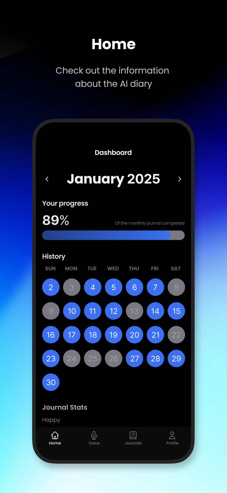
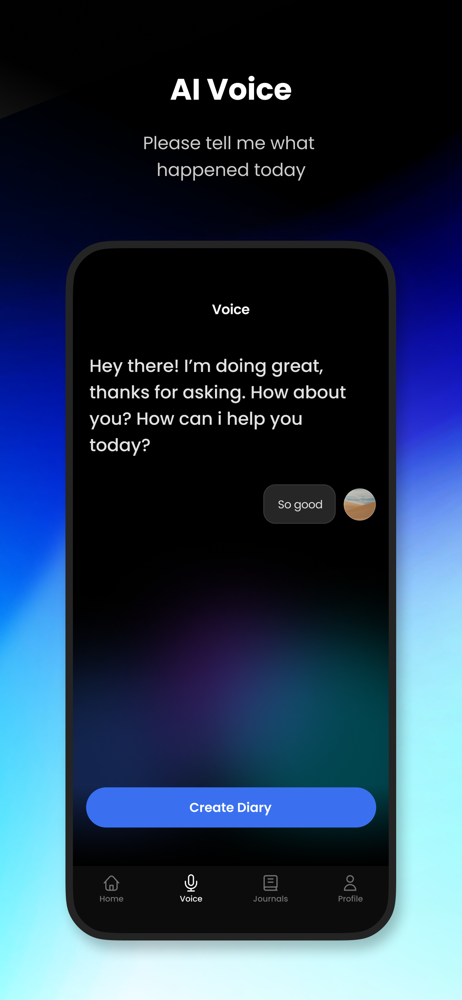
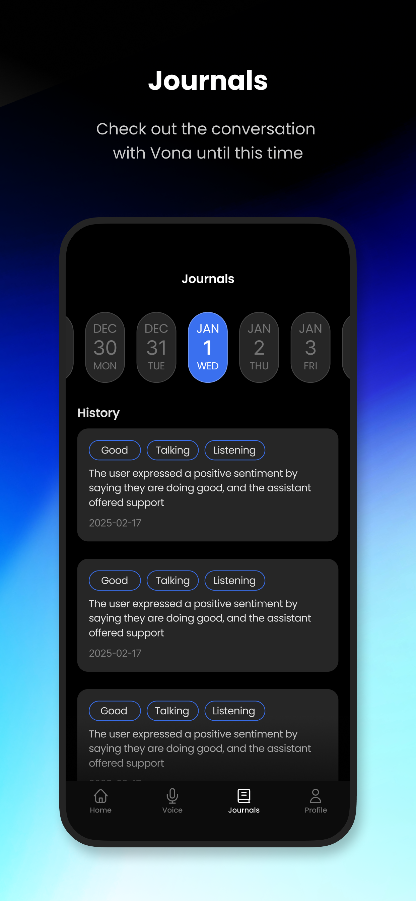

# Vona App

Vona는 OpenAI의 realtime API를 활용하여 실시간으로 AI와 대화하고, 그 대화를 바탕으로 하루를 정리하는 Flutter 모바일 애플리케이션입니다. 사용자들이 매일 하루를 쉽게 트래킹하고 어제보다 더 나은 오늘을 살 수 있도록 도와줍니다.

## Features

- 실시간 AI 대화 기능을 통한 일상 정리
- 하루 활동 트래킹 및 분석
- 개인화된 목표 설정 및 달성 현황 확인
- 일별/주별/월별 리포트 생성
- 감정 분석 및 긍정적인 일상 습관 형성 지원

## Screenshots

<div align="center">
  
  
  
  
</div>

## Tech Stack

- Flutter SDK
- Dart language
- OpenAI API (realtime 기능)
- Firebase (인증 및 데이터 저장)
- Provider/Riverpod (상태 관리)
- Hive (로컬 데이터 저장)

## Project Structure

```
lib/
├── main.dart           # 앱 진입점
├── models/             # 데이터 모델
├── screens/            # 앱 화면
│   ├── chat/           # AI 대화 화면
│   ├── summary/        # 일일 요약 화면
│   └── profile/        # 사용자 프로필 화면
├── widgets/            # 재사용 가능한 UI 컴포넌트
├── services/           # API 및 비즈니스 로직
│   ├── ai_service.dart # OpenAI 연동
│   └── auth_service.dart # 인증 서비스
└── utils/              # 헬퍼 함수 및 상수
```

## License

이 프로젝트는 독점 라이센스를 따릅니다 - 자세한 내용은 LICENSE 파일을 참조하세요.

## Acknowledgments

- OpenAI API 팀
- Flutter 커뮤니티
- 베타 테스트에 참여해 주신 모든 분들
